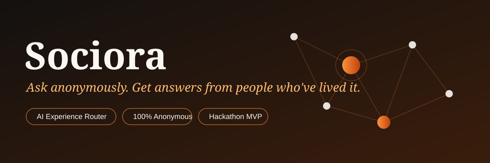
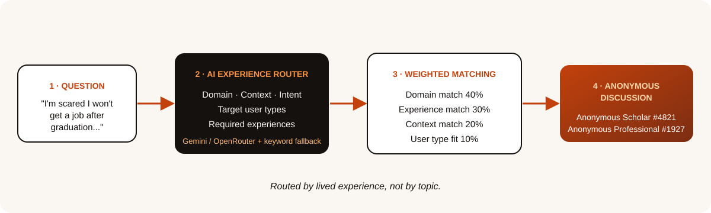
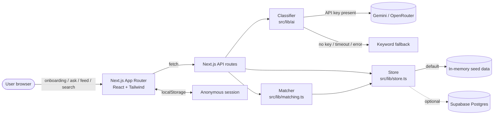
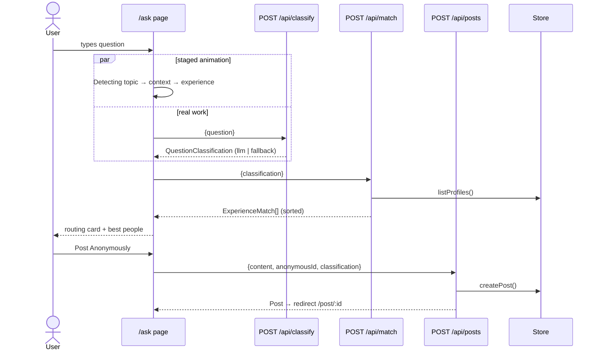
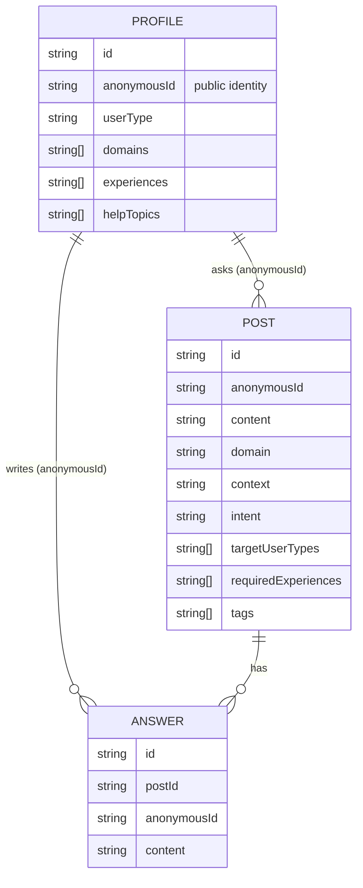

<p align="center">
  
</p>

<p align="center">
  
  
  
  
  
</p>

## The problem

When you're scared about your career, being bullied by a manager, or lost in a decision, the best answer comes from someone who **has been exactly there**. Today:

- **Reddit / Quora** route your question to a *topic*. You get whoever happens to be scrolling.
- **ChatGPT** gives fluent, generic advice with zero lived experience.
- **Asking under your real name** means you don't ask the honest question at all.

## The idea

> **Reddit routes your question to a topic. Sociora routes it to people who've lived it.**

You ask anonymously. An **AI Experience Router** works out the *domain, context, intent and required experience* behind your question, then finds the people whose lived experience fits. Everyone, asker and answerer, stays anonymous (`Anonymous Scholar #4821`).

<p align="center">
  
</p>

### Example

| | |
|---|---|
| **Question** | *"I'm a final-year engineering student and I'm scared I won't get a job after graduation."* |
| **Domain** | Career (secondary: Psychology) |
| **Context / Intent** | College · Advice |
| **Best perspectives** | Students · Working Professionals |
| **Required experience** | Job Search · College Life · Mental Wellbeing |
| **Not** | dumped into a generic Psychology feed |

<!-- Screenshots: replace once the UI is merged
<p align="center"> </p>
-->

## Features

- **Anonymous onboarding** — 4 questions, only what improves routing
- **Anonymous identity** — `Anonymous Builder #7318`; real info is never shown
- **AI question classification** — LLM (Gemini/OpenRouter) with a deterministic fallback
- **Experience routing + relevant-people matching** — transparent weighted score
- **Community feed** — filter by domain, badges and experience tags
- **Anonymous questions & answers**
- **Context-aware search** — understands "how do I prepare for a software interview?" as *Technology · Job Search · Advice*

## High-level design (HLD)



**Design principles:** no env var can crash the app, so every external dependency (LLM, DB) has a local fallback. No vector DB, no microservices, no ML recommender. Simple and explainable beats clever in a hackathon.

## Low-level design (LLD)

### 1. The ask → route → post flow



### 2. Data model



The structured profile is used **privately for routing**. Only `anonymousId` is ever returned to other users.

### 3. Experience Router output

```json
{
  "domain": "Career",
  "secondaryDomain": "Psychology",
  "context": "College",
  "intent": "Advice",
  "targetUserTypes": ["Student", "Working Professional"],
  "requiredExperiences": ["Job Search", "College Life", "Mental Wellbeing"],
  "tags": ["career anxiety", "placements"],
  "confidence": 0.82,
  "source": "llm"
}
```

LLM output is **validated against closed enums** (unknown values dropped, confidence clamped, gaps filled from the fallback), so a bad model response can't break the UI.

### 4. Matching algorithm

```
score = 0.40 · domain      (primary = 1.0, secondary = 0.5)
      + 0.30 · experience  (shared required experiences / required)
      + 0.20 · context     (context → typical experiences & domains)
      + 0.10 · userType    (profile type ∈ targetUserTypes)
```

Deterministic, explainable, instant. A match can show *why* it was chosen (the shared experiences).

### 5. API contract

| Method | Route | Purpose |
|---|---|---|
| POST | `/api/classify` | question → `QuestionClassification` |
| POST | `/api/match` | classification → ranked `ExperienceMatch[]` |
| POST / GET | `/api/profile` | create / fetch anonymous profile |
| GET / POST | `/api/posts` | feed (`?domain=`) / create post |
| GET | `/api/posts/:id` | post + answers |
| POST | `/api/posts/:id/answers` | add anonymous answer |
| GET | `/api/search?q=` | context-aware search → classification + posts + people |

Types live in [`src/types/index.ts`](src/types/index.ts).

### 6. Project structure

```
src/
├─ types/index.ts          shared data contract
├─ lib/
│  ├─ ai/classify.ts       LLM classifier (Gemini / OpenRouter)
│  ├─ ai/fallback.ts       deterministic keyword classifier
│  ├─ matching.ts          weighted scoring
│  ├─ store.ts             data layer (in-memory seed, swappable)
│  ├─ identity.ts          anonymous ID generator
│  └─ session.ts           localStorage session
├─ app/
│  ├─ api/*                classify · match · profile · posts · search
│  └─ (pages)              / · onboarding · ask · feed · post/[id] · search
supabase/schema.sql        optional Postgres schema
scripts/smoke.mjs          router smoke test
```

## Run it

```bash
npm install
cp .env.example .env.local     # every key is optional
npm run dev                    # http://localhost:3000
```

| Env var | Effect |
|---|---|
| `GEMINI_API_KEY` | LLM classification via Gemini (preferred) |
| `OPENROUTER_API_KEY` | LLM classification via OpenRouter |
| `NEXT_PUBLIC_SUPABASE_URL` / `_ANON_KEY` | Optional Postgres (schema in `supabase/schema.sql`) |

No keys? It still works: keyword classifier plus seeded in-memory data.

```bash
node scripts/smoke.mjs         # classify + match + search sanity check
```

## Roadmap

- Learn from "this answer helped" signals to improve matching
- Embeddings-based semantic retrieval for search
- Moderation and abuse reporting; reputation tied to anonymous IDs
- Verified-experience badges (e.g. "verified: placed at a product company")
- Campus and employer community spaces

## Team

Built in a hackathon sprint by a team of three, split across **AI router**, **community & data** and **onboarding & routing UI**. See [`docs/`](docs/) for the workstream briefs and the [demo script](docs/DEMO_SCRIPT.md).
